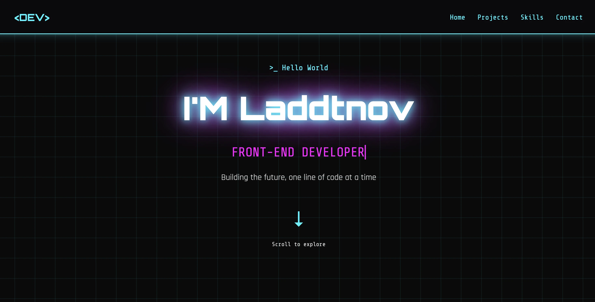
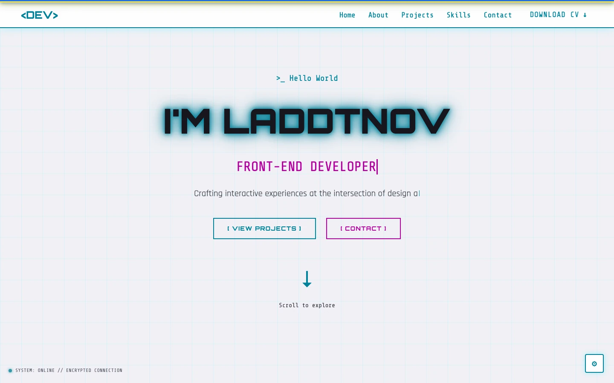

# Laddtnov Portfolio

Cyberpunk-style front-end portfolio built with semantic HTML5, modular CSS, and vanilla JavaScript (ES modules). Features a project explorer, interactive settings panel, Konami Easter egg, Web Audio synth sounds, and a custom neon cursor — all without a single framework.

[](https://laddtnov.xyz/)
[](https://developer.mozilla.org/docs/Web/HTML)
[](https://developer.mozilla.org/docs/Web/CSS)
[](https://developer.mozilla.org/docs/Web/JavaScript)
[](backend/)
[](https://www.w3.org/WAI/)
[](https://developer.mozilla.org/docs/Web/CSS/CSS_media_queries)
[](https://schema.org/)
[](https://laddtnov.xyz/)
[](https://developer.mozilla.org/docs/Web/API/Web_Audio_API)
[](https://developer.mozilla.org/docs/Web/CSS/@font-face)
[](https://laddtnov.xyz/)
[](https://laddtnov.xyz/404)




## Live

→ **[laddtnov.xyz](https://laddtnov.xyz/)**

## Features

### UI & Aesthetics
- Neon glow, glitch accents, CRT scanlines, and a cyber-grid background
- Ukrainian flag stripe at the top — a subtle piece of identity
- Fully responsive: hamburger nav, touch targets, 320px → 4K
- Custom neon cursor (desktop only) — enlarges to ring on interactive elements
- Typewriter effect on hero tagline; skips under `prefers-reduced-motion`
- CRT intensity, motion level, and sound toggles in a floating settings panel

### Project Explorer
- Filter by category (Games / Tools / Productivity / Experiments) with live counts
- Sort by newest / oldest / name
- Inspect modal with project details, tech stack, and live link
- Full keyboard focus trap inside modal (WCAG 2.4.3)
- `aria-live` region announces filter results to screen readers

### AI Agent

A floating cyberpunk-styled AI chat widget fixed to the bottom-right corner.

- **Toggle button** — `AI` badge with neon-cyan glow; collapses to icon-only on mobile
- **Chat panel** — scrollable message history, typing indicator, quick-reply chips
- **Crypto-random IDs** — message IDs generated with `crypto.getRandomValues()` (no `Math.random()`)
- **`<dialog>` element** — semantic HTML with `position: static` override so the panel stays in flex flow
- **Responsive** — full-screen overlay on mobile (≤ 480 px) with slide-up animation

### Personality
- **Konami Easter egg** — `↑↑↓↓←→←→BA` triggers a glitching "ACCESS GRANTED" overlay
- **Web Audio synth sounds** — no audio files; pure `OscillatorNode` blips per interaction
- **Copy-email button** — copies `novytskiyvladislav@proton.me`, shows `Copied!` in green for 2s

### Technical
- Branded `404.html` — "SIGNAL LOST" with flickering code, scanlines, and UA flag stripe
- GitHub live stats pulled from the API (repos / followers / stars) shown in About
- JSON-LD Person schema, `robots.txt`, and `sitemap.xml` for SEO
- Self-hosted fonts (`assets/fonts/`) — no Google Fonts dependency
- OG image compressed from 672KB PNG → 13.7KB WebP (48× smaller)
- Lazy-loaded project thumbnails with async decoding
- Go backend contact API deployed to Fly.io — HTML email template with cyberpunk styling

### Accessibility (WCAG)
- `aria-pressed` on filter buttons, `aria-live` on filter results
- `prefers-reduced-motion` respected at OS and manual toggle levels
- Focus trap in project modal; focus restored to trigger on close
- `<fieldset>` + `<legend>` for all button groups
- Reduced-motion disables `dot-blink`, `glitch-shake`, and typewriter

## Stack

| Layer | Tech |
|-------|------|
| Markup | HTML5 (semantic, ARIA) |
| Styles | CSS3 (modular files, custom properties) |
| Logic | Vanilla JS (ES modules, event bus) |
| Backend | Go — contact API on Fly.io |
| Fonts | Self-hosted woff2 — Orbitron, Rajdhani, Share Tech Mono |
| Audio | Web Audio API (`OscillatorNode`, `GainNode`) |
| Data | GitHub REST API, localStorage settings |
| Deploy | Vercel (frontend) + Fly.io (backend) |

Two pieces of this site have been extracted and published on their own:
[`@laddtnov/cyberpunk-ui`](https://github.com/laddtnov/cyberpunk-ui), the neon
CSS kit, which this site then consumes back over CDN with an SRI hash; and
[Neonflux](https://github.com/laddtnov/Neonflux), an Obsidian theme built on
the same palette.

## Project Structure

```
laddtnov-hub/
├── index.html
├── 404.html
├── sw.js
├── robots.txt
├── sitemap.xml
├── json/
│   ├── manifest.json
│   └── lighthouserc.json
├── css/
│   ├── base.css
│   ├── navbar.css
│   ├── welcome.css
│   ├── about.css
│   ├── projects.css
│   ├── skills.css
│   ├── contact.css
│   ├── components.css
│   ├── agent.css
│   └── responsive.css
├── js/
│   ├── main.js
│   ├── motion.js
│   ├── ui.js
│   ├── projects.js
│   ├── settings.js
│   ├── easter-egg.js
│   ├── sounds.js
│   └── agent.js
├── products/
│   ├── index.html          # catalog
│   └── *.html              # one page per project
├── assets/
│   ├── avatar.svg
│   ├── favicon.png
│   ├── icon-192.png
│   ├── icon-512.png
│   ├── apple-touch-icon.png
│   ├── og-image.webp
│   ├── cv-vladislav-novytskiy.pdf
│   ├── fonts/
│   └── thumbnails/
├── backend/
│   ├── main.go
│   ├── handler.go
│   ├── email.go
│   ├── validate.go
│   ├── go.mod
│   ├── go.sum
│   ├── Dockerfile
│   └── fly.toml
└── docs/
    └── screenshots/
        ├── hero.webp
        ├── hero-light.webp
        ├── agent-toggle.jpg
        └── agent-panel.jpg
```

## Featured Projects

| Project | Type | Description | Link |
|---------|------|-------------|------|
| **Orrery** | 3D Simulation | Solar system with Fallout-style terminal and positional audio | [orrery.laddtnov.xyz](https://orrery.laddtnov.xyz/) |
| **Libra** | Tool | Book tracker with terminal UI, progress stats, and reading streaks | [libra.laddtnov.xyz](https://libra.laddtnov.xyz/) |
| **Breach OS** | Game | Cyberpunk memory card game with missions and neon effects | [breachos.app](https://breachos.app/) |
| **Cogsworth** | Game | Steampunk Sudoku with rank system, survival mode, and PWA install | [cogsworth.laddtnov.xyz](https://cogsworth.laddtnov.xyz/) |
| **GrowFlow** | Tool | Personal finance tracker with Chart.js dashboard | [growflow.laddtnov.xyz](https://growflow.laddtnov.xyz/) |
| **TimeFlow** | Productivity | React + Vite appointment tracker with weekly calendar view | [timeflow.laddtnov.xyz](https://timeflow.laddtnov.xyz/) |
| **Vitrum** | Game | Glassmorphism chess with smooth drag animations | [vitrum.bynov.one](https://vitrum.bynov.one/) |
| **Trailune** | Tool | SvelteKit + TypeScript travel tracker, fully local, no backend | [trailune.laddtnov.xyz](https://trailune.laddtnov.xyz/) |
| **Voidarium** | Experiment | Animated galaxy map with click-to-travel navigation, vanilla Canvas | [voidarium.vercel.app](https://voidarium.vercel.app/) |
| **cyberpunk-ui** | Package | Zero-dependency neon CSS kit extracted from this site, published to npm | [npm](https://www.npmjs.com/package/@laddtnov/cyberpunk-ui) · [repo](https://github.com/laddtnov/cyberpunk-ui) |
| **Neonflux** | Theme | Obsidian theme on the cyberpunk-ui palette, in the community catalog | [obsidian](https://community.obsidian.md/themes/neonflux) · [repo](https://github.com/laddtnov/Neonflux) |

## Quick Start

```bash
git clone https://github.com/laddtnov/laddtnov-hub.git
cd laddtnov-hub
open index.html   # or use Live Server in your editor
```

No build step. No dependencies. No `node_modules`.

## Contact

- GitHub: [@laddtnov](https://github.com/laddtnov)
- LinkedIn: [linkedin.com/in/vladyslav-novytskyi-32ab8b416](https://www.linkedin.com/in/vladyslav-novytskyi-32ab8b416)
- Email: [novytskiyvladislav@proton.me](mailto:novytskiyvladislav@proton.me)
